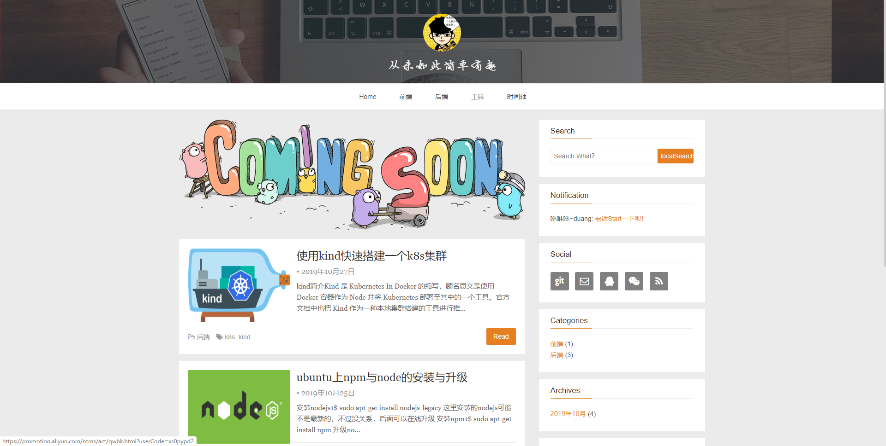

# Blog
Blog是基于hexo以及[hexo-theme-snippet](https://github.com/shenliyang/hexo-theme-snippet)主题的一个个人微博网站。


## 一、写文章
### 1. 生成文章主题
```
$ hexo new "【文章主题】我是一个demo"
INFO  =========================================
INFO    Welcome to use Snippet theme for hexo
INFO  =========================================
INFO  Created: F:\javascript\blog\source\_posts\【文章主题】我是一个demo.md
```
### 2. 编写文章内容
打开blog\source\_posts目录下的`【文章主题】我是一个demo.md`文件，编写你要发布的文章即可。
```
---
title: 【文章主题】我是一个demo
categories:
  - 前端
  - 分类2
tags:
  - 标签1
  - 标签2
comments: false
date: 2019-10-27 22:45:52
img:
---

# Demo
## 这是一个Demo演示
- 步骤一
- 步骤二
- 步骤三
```

## 二、本地查看
```
$ ./startup.sh
```
通过本地的`localhost:4000`访问。

## 三、文章发布
```
$ ./deploy.sh
deploy success !
```